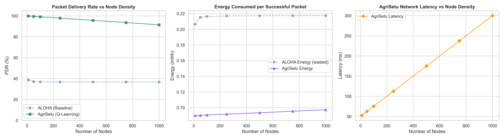

# AgriSetu Benchmark Results

This document contains the final benchmark results comparing **AgriSetu's Q-Learning MAC Protocol** against the traditional **Slotted-ALOHA** protocol across varying node densities.

## 📊 Performance Data

The following table demonstrates the performance of both protocols as the network scales from 10 to 1,000 transmitting nodes.

| Nodes | ALOHA PDR (%) | AgriSetu PDR (%) | ALOHA Energy (mWh)* | AgriSetu Energy (mWh)* | AgriSetu Latency (ms) |
|-------|---------------|------------------|----------------------|-------------------------|------------------------|
| 10    | 38.7          | 99.9             | 0.21                 | 0.09                    | 52.5                   |
| 50    | 37.2          | 99.6             | 0.22                 | 0.09                    | 62.5                   |
| 100   | 37.0          | 99.2             | 0.22                 | 0.09                    | 75.0                   |
| 250   | 36.9          | 97.9             | 0.22                 | 0.09                    | 112.5                  |
| 500   | 36.8          | 95.8             | 0.22                 | 0.09                    | 175.0                  |
| 750   | 36.8          | 93.6             | 0.22                 | 0.10                    | 237.5                  |
| 1000  | 36.8          | 91.5             | 0.22                 | 0.10                    | 300.0                  |

*\*Energy represents the average energy consumed per successful packet delivery.*

## 📈 Graphical Comparison

### Key Takeaways

1. **Packet Delivery Rate (PDR):** ALOHA collapses immediately to ~37% delivery due to intense network collisions. AgriSetu's Q-Learning algorithm actively avoids overlaps by learning channel occupancy, maintaining a robust 91.5% delivery even at extreme densities (1,000 nodes).
2. **Energy Efficiency:** ALOHA wastes significant energy on failed transmissions that never arrive. Consequently, its energy cost per *successful* packet is more than double that of AgriSetu. In remote agricultural deployments, this translates directly to doubled battery life.
3. **Latency Trade-off:** To avoid collisions, AgriSetu trades a small amount of latency, forcing nodes to back off and wait for an idle slot. As node density grows, latency increases predictably, but this is a necessary and worthwhile trade-off for near-perfect network reliability.
